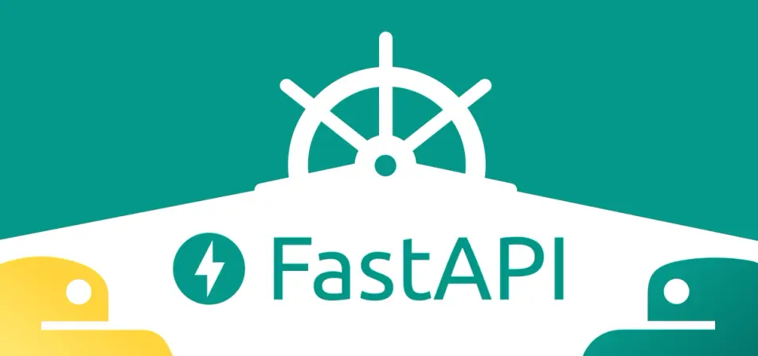

# FastAPI Project

This project is a [FastAPI](https://fastapi.tiangolo.com/) project based on the campaign of the StackUp Campaign of 2024: 

***Developing an API Server with FastAPI***

## Description

FastAPI is a widely adopted web framework for building robust web applications with Python. It stands out for its remarkable speed, as its name suggests, and is categorized as an asynchronous web framework, enabling developers to create high-performance APIs effortlessly.

Unlike many other frameworks, FastAPI comes equipped with automatic data validation, serialization, and interactive documentation generation, reducing the need for third-party tools or libraries.

Some of the most well-known platforms and services, such as Uber, Netflix, and Starlink, have harnessed the power of FastAPI to create cutting-edge applications. We will delve into the core aspects of FastAPI, enhancing your web development repertoire.

## Development 
### First Run

`uvicorn main:app --reload`

Once you see the message 'Application startup complete', open your application in the browser by either entering http://127.0.0.1:8000 as the URL, or clicking the link provided in your terminal output (Uvicorn running on http://127.0.0.1:8000). 

## Requirements
- [FastAPI](https://fastapi.tiangolo.com/)
- [uvicorn](https://github.com/encode/uvicorn)

## References

- [FastAPI](https://fastapi.tiangolo.com/)
- [StackUp](https://stackup.com/campaign/2024)
- [Introduction to FastAPI](https://refine.dev/blog/introduction-to-fast-api/#benefits-of-using-fastapi)

