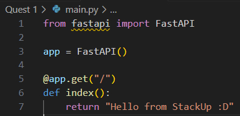
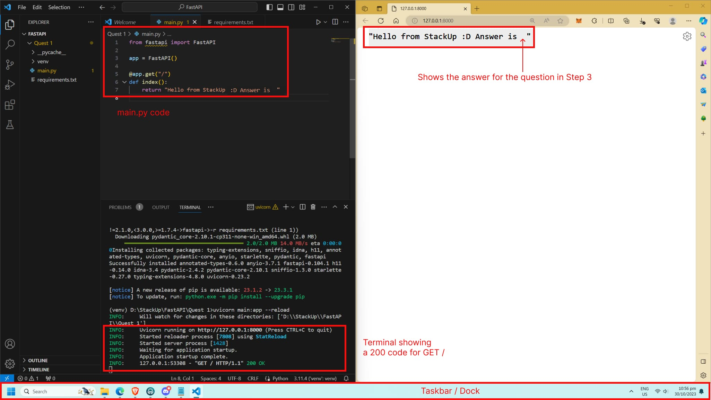

# Tutorial 1: Introduction to FastAPI

## Learning Outcomes

### Upon completing your learning, you will be able to:

- Explain what FastAPI is and its benefits compared to other frameworks
- Set up a development environment for FastAPI
- Create a basic FastAPI application

## Quest Details
### Introduction
Ready to embark on a journey to discover FastAPI? It is a lightweight web development framework that excels in delivering efficient applications with minimal code. We will delve into what FastAPI is, highlight its advantages, and showcase its diverse applications.

You will acquire the skills to develop a FastAPI web application, which can incorporate other packages and libraries to create more sophisticated and functional APIs. Finally, you will be well-equipped to harness FastAPI's capabilities and easily construct intricate web applications.


## Quest Steps
Total Steps: 4


### Step 1: The Capabilities of FastAPI
Before we get to creating the web application with Flask, it is important to learn about Flask and why it could be a web development framework worth using.

For a basic introduction, read [this article](https://refine.dev/blog/introduction-to-fast-api/#benefits-of-using-fastapi) for a quick overview of FastAPI.

FastAPI offers a multitude of benefits that make it a preferred choice for web application development. Here are the key advantages summarized in a list:

- **Speed and Performance:** FastAPI is renowned for its exceptional speed, thanks to its asynchronous capabilities. It can efficiently handle a large number of requests, making it ideal for high-performance applications.
- **Automatic Data Validation:** FastAPI automatically validates incoming data, reducing the risk of errors and vulnerabilities in your application. This feature simplifies input handling and improves data security.
- **Scalability:** FastAPI is well-suited for both small projects and large-scale applications, making it a versatile choice for developers with varying needs

### Step 2: Installing FastAPI
With your newfound knowledge of FastAPI, it's time to embark on the development journey! To kick things off, let's establish a development environment tailored to your FastAPI application.

We will create a virtual environment that encapsulates a self-contained Python environment to manage dependencies separately. This setup allows you to install and manage Python packages specific to this project or environment, all without impacting your system-wide Python installation or any other ongoing projects. Given that FastAPI is written in Python, those who are already familiar with the language will find these steps familiar.

You will need to install Python 3 and its package manager “pip”. To check if you have Python installed on your computer, you can enter the command `python --version` in your terminal. If a version number is returned, you have it installed. For users using cloud development environments like Gitpod, Codespaces and Google Cloud Shell, you most likely have Python and pip already installed.

🪟 For **Windows users**, you may download and install it at [Python’s official website](https://www.python.org/downloads/).

🍎 For **Mac users**, enter the following command in your terminal

`brew install python`

We will create a folder **FastAPI**. In this folder, create a folder named **tut1**. Within tut1,  create two new files – **main.py** and **requirements.txt**.

Next, open a terminal in the **tut1** directory and run the following command to create a virtual environment. The **venv** module is a built-in module in Python used for creating virtual environments.

`python3 -m venv ./venv/`

Next, we will be using the following command to activate the virtual environment that we just created. Once the command runs, you will notice the prompt in your terminal change, which now includes (venv). This indicates that you are now working in the virtual environment.

For Windows users

`.\venv\Scripts\activate.bat`
For MacOS and Linux users

`source ./venv/bin/activate`
Next, in **requirements.txt**, enter the following and save the file.

```text
    fastapi
    uvicorn
```

Plain text
Then, run the following command in your terminal to install the required packages that we listed in the requirements.txt file.

`pip install -r requirements.txt`

Uvicorn is a server implementation for Python. It is used primarily for running asynchronous web applications built with frameworks like FastAPI and Starlette.

### Step 3: Creating Your First FastAPI Application
Firstly, open **main.py** in your code editor, and enter this line.

```python
from fastapi import FastAPI
```

This line imports the FastAPI module from the fastapi library which you will use later on.

Next, initialise your application with this line.

```python
app = FastAPI()
```

This creates a FastAPI application in which you can include other functions and use it as a wrapper for the HTTP requests.

Now, let’s create the first route. In a typical website, your URL or link would look like this: https://www.examplewebsite.com/page. In this case, the route is defined as “/page”.

Let’s try replicating that by entering this code snippet next.

```python
@app.get("/")
def index():
    return "Hello from StackUp :D"
```

This creates a route at “/” which will return the text “*Hello from StackUp :D!*”.

Your final code in main.py should look like this.



Ensure your file is saved. Then, use uvicorn to run the FastAPI application with this command in your terminal.

`uvicorn main:app --reload`

Once you see the message 'Application startup complete', open your application in the browser by either entering http://127.0.0.1:8000 as the URL, or clicking the link provided in your terminal output (Uvicorn running on http://127.0.0.1:8000). 

You should see your website hosted on your computer and the message “*Hello from Stackup :D*”.

Congratulations! You have just created a simple app with FastAPI. 

**Your Submission**

To check that you have read the article in Step 1, answer the following question:

**Which of the following benefits does FastAPI provide?**

A. Automatic API documentation generation

B. Built-in ORM and authentication mechanisms

C. Use of the WSGI ecosystem for high performance

D. Complex and rigid app structure

Then, in line 7 of main.py, add "Answer is x" within the return statement, where x is the alphabet of your answer. For example, if you choose B, your return statement should now be:

> ```
> return "Hello from StackUp :D Answer is B"
> ```

### Step 4: Let’s Ace Your Submissions! Complete Your Quiz and Prepare Your Submission!
You have reached the end! Now to make sure you successfully complete this quest! There is **1 deliverable** that is required for this quest, a screenshot. Make sure you complete it before submitting this quest!

You will need to take a screenshot of your coding window and your browser side by side.

Your screenshot should show:

- your full screen, including your [taskbar](https://community-library.netlify.app/blog/what-if-i-don't-have-a-taskbar/) (for Windows and Linux) / dock (for MacOS)
- your code editor with the code in main.py
The terminal showing a 200 status code for GET /
a browser tab with the content from the API server, including the answer to the question in Step 3. Where possible, zoom in so that the message can be easily seen.
make sure that all parts visible in ‘Expected output’ in this step are also visible in your screenshot(s)!

Expected Output. Right click to open in a new tab for full resolution.

In the event that your screen is not wide enough to accommodate two windows side by side, you may take the screenshots separately and then [merge them into one image](https://stackie-tool.streamlit.app/).

When labelling your screenshot, make sure to follow the format provided: **C27_Q1_yourstackupusername.png**.

**Note**: You can retrieve your StackUp username by clicking on the burger menu at the top right-hand corner of this page. You can read [this article](https://stackuphelpcentre.zendesk.com/hc/en-us/articles/25416574073625-How-to-obtain-your-Campus-Learn-and-Earn-v2-0-username-) on how to obtain your StackUp username.

By submitting the quest, please note that our StackUp Policy prohibits the use of multiple accounts by a single user and the submission of copied work.