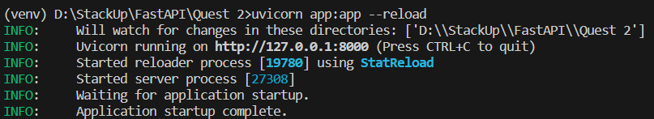
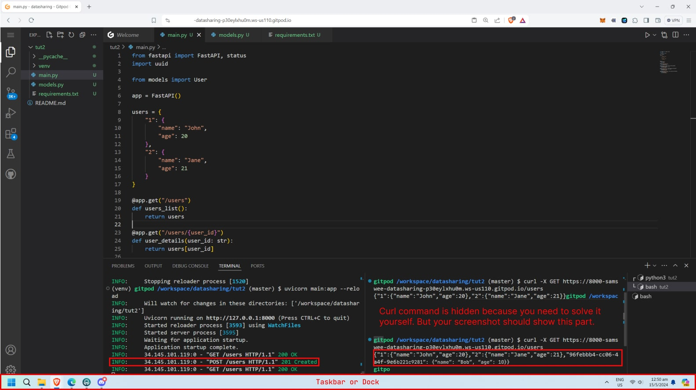
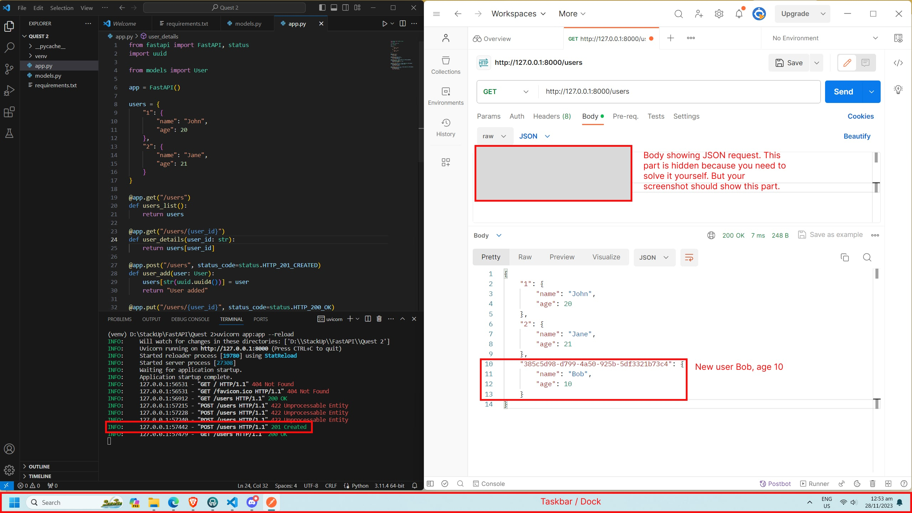

# Tutorial 2: Creating a Basic API Server with FastAPI

## Learning Outcomes
Upon completing your learning, you will be able to:

- Understand how FastAPI works
- Create a Pydantic model
- Create simple CRUD API routes
- Use Postman to test your API

## Quest Details
### Introduction
Previously, you learnt about FastAPI and its capabilities, created your development environment, and deployed a basic FastAPI web application. However, the website currently only returns text upon receiving a GET request. You will be adding more routes than a typical API server would have.

You will learn how to create a basic API that can create, read, update and delete operations for a single data structure. Thereafter, we will be using the Postman application to test our API.

For this quest, you can attempt it using a cloud development environment like Codespaces and Gitpod, or on your local device.

## Quest Steps
Total Steps: 9

### Step 1: Basic HTTP with FastAPI
Previously, you created a single route at “/” for a page that simply returns some text upon receiving a GET request. However, API servers are expected to have many more endpoints that support various request methods for different purposes.

Typically, this is how API servers work in the context of managing users, with reference to the CRUD framework.

**GET** - Read

**POST** - Create

**PUT** - Update

**DELETE** - Delete

For example, the API endpoint for retrieving a list of users would look like

`GET /users`

For adding a new user to the database, it could look like the following, with a JSON body.

```
    POST /users

    {
        “username”: “john”,
        “email”: “john@stackup.com”
    }
```

And it would be very similar to updating an existing user.

```
    PUT /users

    {
        “username”: “john”,
        “email”: “john@stackup.com”
    }
```
To delete a user, a request like this could be utilised, to delete a user with the ID 1.

`DELETE /users/1`

There are many other ways API servers can be set up, including using query parameters like in “DELETE /users?id=1”, but it all depends on preference.

### Step 2: Routing with FastAPI
We now know how HTTP request methods can be utilised in creating an API server. However, different web frameworks utilise different methods for handling these request methods.

Previously, we used the following code to create the endpoint to return text when a GET request is made to “/”.

```python
    @app.get("/")
    def index():
        return "Hello from StackUp :D"
```
In the first line of this specific block of code, a decorator is used to add a handler for GET requests, as seen in “app.get”, including the route(“/”) as an argument.

To create handlers for other request methods, all you have to do is edit the “get” portion of the decorator. For an API endpoint for users, it would be:

```python
    @app.get("/users")
    @app.post("/users")
    @app.put("/users")
    @app.delete("/users/<int:id>")
```

### Step 3: Setting Up Our Environment
We will create some endpoints that will allow users to interact with our database with different HTTP methods.

For simplicity, let’s create a new folder **tut2** to prevent issues of conflict with your previously written code.

Within the tut2 folder, create 3 files – **main.py**, **models.py **and **requirements.txt**.

Next, create a virtual environment. Open a terminal in the **tut2** directory and run the following command to create a virtual environment. The venv module is a built-in module in Python used for creating virtual environments. Note, if python3 does not work, you can try using python.

`python3 -m venv ./venv/`

To initialise your virtual environment, you will need to enter the following command in your terminal. Once done, you should see (venv) appear in front of your direction in your terminal.

🪟 Windows users: `.\venv\Scripts\activate.bat`

🍎 MacOS and Linux Users: `source ./venv/bin/activate`

Then, declare the dependencies to install in requirements.txt. Be sure to save your file once done.

```
    fastapi
    uvicorn
    pydantic

```

Pydantic is a Python library crucial for data validation in web frameworks like FastAPI. Leveraging Python type annotations, it defines data models. FastAPI then uses these models to validate incoming request data and serialize response data. Its clear error messages and automatic documentation generation make it indispensable for efficient web development, enhancing robustness and productivity in creating and managing APIs.

In the terminal, we will proceed to install our dependencies with the following command.

`pip3 install -r requirements.txt`

### Step 4: Creating Our User Model
To define the data structures we will use in the application, we will use Pydantic. This will ensure that the data in request bodies match a specific predefined rule set.

You can read more about Pydantic [here](https://docs.pydantic.dev/latest/).

Open **models.py** and add the following code. This code creates a Pydantic model for our User object.

```python
  from pydantic import BaseModel

  class User(BaseModel):
      name: str
      age: int
```

### Step 5: Developing the API
Next, open **main.py** and paste the following code to import the User model we just created, and for FastAPI to create the application.

```python
    from fastapi import FastAPI, status
    import uuid

    from models import User

    app = FastAPI()
```

For simplicity's sake, we will use a hard-coded dictionary to store and list our users' information comprising their names and ages. At line 8, enter the following code.

```python
users = {
    "1": {
        "name": "John",
        "age": 20
    },
    "2": {
        "name": "Jane",
        "age": 21
    }
}
```

For an extremely simple API that does not interact with a database, we can use simple Python functions to interact with the dictionary of users we created earlier.

To retrieve a list of users, we use the following function to return the whole list of users upon a GET request to /users. Paste the following code.

```python
@app.get("/users")
def users_list():
    return users
```

However, if only the information of a single user is required, we can utilise a path parameter to return a specific user in the dictionary. Paste the following code.

```python
@app.get("/users/{user_id}")
def user_details(user_id: str):
    return users[user_id]
```

For the subsequent endpoints, we will respond with non-default status codes to indicate the status of the operation requested.

In some web applications, administrators may be able to add users to the database, which typically involves a POST request to /users. We will use the `uuid` package to generate random user IDs to ensure we have unique IDs. Paste the following code.

```python
@app.post("/users", status_code=status.HTTP_201_CREATED)
def user_add(user: User):
    users[str(uuid.uuid4())] = user
    return "User added"
```

Notice that we used our `User` model in line 2 of this code. This means that the endpoint accepts a JSON request body that is required to follow the model structure we defined earlier in models.py. A recap, this is the model structure:

```python
class User(BaseModel):
    name: str
    age: int
```

The following is an example of a valid request body.

```json
{
	“name”: “Bob”
	“age”: 10
}
```

This data is valid as the name provided is a string and the age is an integer.

Similarly, administrators would be able to update users, but with a PUT request instead. The user_id argument comes from the URL path. For example, if the user sends a PUT request to /users/1/, the user with the ID 1 would be updated.

This endpoint also accepts a JSON request body that matches our User model. Paste the following code.

```python
@app.put("/users/{user_id}", status_code=status.HTTP_200_OK)
def user_update(user_id: str, user: User):
    users[user_id] = user
    return "User updated"
```

Lastly, we have an endpoint to delete users by their ID. Paste the following code.

```python
@app.delete("/users/{user_id}", status_code=status.HTTP_200_OK)
def user_delete(user_id: str):
    del users[user_id]
    return "User deleted"
```

At this point, you can check against this [GitHub Gist](https://gist.github.com/stackup-dev/0eb4e0bf8157de187174dca4d8936643) to see if you have pasted the code correctly for main.py.

###Step 6: Running the Application
In your terminal, enter the following command to run the application.

`uvicorn main:app --reload`



Then, click on the URL provided in the terminal (http://127.0.0.1:8000). You will see a message '{"detail":"Not Found"}'.

In the URL, append /**users**  at the end

⚠️ Note: For cloud development environment users, do ensure that 'users' is appended immediately after the top-level domain. For example, https://8000-cs-125-southeast1-mu.cloudshell.dev/users

You should now see the JSON response.

```json
{"1":{"name":"John","age":20},"2":{"name":"Jane","age":21}}
```

### Step 7: Testing the API (Option 1 - using cURL)
This option is suitable for Mac and Linux users (including those using a cloud development environment like Gitpod). ⚠️ Users of Google Cloud Shell may encounter difficulties using this. 

First, we establish our API URL. That is the URL you obtained in the previous steps, e.g. http://127.0.0.1:8000/users. For Gitpod users, your URL may look like this: https://8000-name-folder-p30eylxhu0m.ws-us110.gitpod.io/users

Next, let's send a GET request to retrieve the list of users. In your terminal, enter the following command. For Gitpod users, change the URL accordingly.

`curl -X GET http://127.0.0.1:8000/users`

You should then receive an output.

```json
{"1":{"name":"John","age":20},"2":{"name":"Jane","age":21}}
```

Now that you have sent a GET request, here's a challenge 💪.


<font color="red">Send a POST request to create a new user. You will need to create a new user named “Bob” who is age 10.
> </font>
<font color="green">You will know that you have successfully created a new user when you retrieve the list of users again.</font>

### Step 8: Testing the API (Option 2 - using Postman)
This option is suitable for Windows users and users who are not familiar with the cURL command.

Head to the [Postman website](https://www.postman.com/downloads) and download the installation package for your operating system. Follow the instructions on the installer and create an account.

After setting up, you should see this page.


Click “**My Workspace**” and you will see a workspace that allows you to manage your collections and requests.

Next to the “Overview” tab, click on the “+” icon to create a new request in the workspace.


Enter your API URL, which should be http://127.0.0.1:8000/users, into the URL field and click on “**Send**” to send a GET request to retrieve the list of users.

⚠️ Note: For cloud development environment users, such as Codespaces, do ensure that you have set the port visibility of port 8000 to public. Also, use the forwarded address provided by the cloud development environment. 


Now that you’ve sent a GET request with Postman, here's a challenge.

Try to send a POST request to create a new user. You will need to create a new user named “Bob” who is age 10. You will need to [figure out how to send a JSON request body](https://learning.postman.com/docs/sending-requests/requests/#sending-body-data) and include it in your POST request.

After sending a successful POST request, you should receive the response as shown below.


⚠️ Note: Do not delete the request body as you will need it for your submission.

Then, attempt to retrieve the list of users again using a GET request, you will see a new user at the bottom of the JSON response.


### Step 9: Let’s Ace Your Submissions! Preparing Your Submission!
You have reached the end! Now to make sure you successfully complete this quest! There is **1 deliverable** required for this quest, a screenshot. Make sure you complete it before submitting this quest!

**For users who went with Option 1:** Take a screenshot of your VS Code interface with the terminal output. 

**For users who went with Option 2:** You will need to take a screenshot of your screen with your Terminal and Postman window side by side.

Your screenshot should show:

- your full screen, including your taskbar (for Windows) / dock (for MacOS)
- The terminal has a 201 status code for POST /users
- the new user named “Bob” who is age 10 in the JSON response
- make sure that all parts visible in ‘Expected output’ in this step are also - visible in your screenshot(s)!
- For Option 2 users, Postman window's Body showing JSON request of adding the user Bob


Option 1 Expected Output. Right click to open in new tab for full resolution.


Option 2 Expected Output. Right click to open in new tab for full resolution.

When labelling your screenshot, make sure to follow the format provided: **C27_Q2_yourstackupusername.png**.

Note: You can retrieve your StackUp username by clicking on the burger menu at the top right-hand corner of this page. You can read [this article](https://stackuphelpcentre.zendesk.com/hc/en-us/articles/25416574073625-How-to-obtain-your-Campus-Learn-and-Earn-v2-0-username-) on how to obtain your StackUp username.

By submitting the quest, please note that our StackUp Policy prohibits the use of multiple accounts by a single user and the submission of copied work.